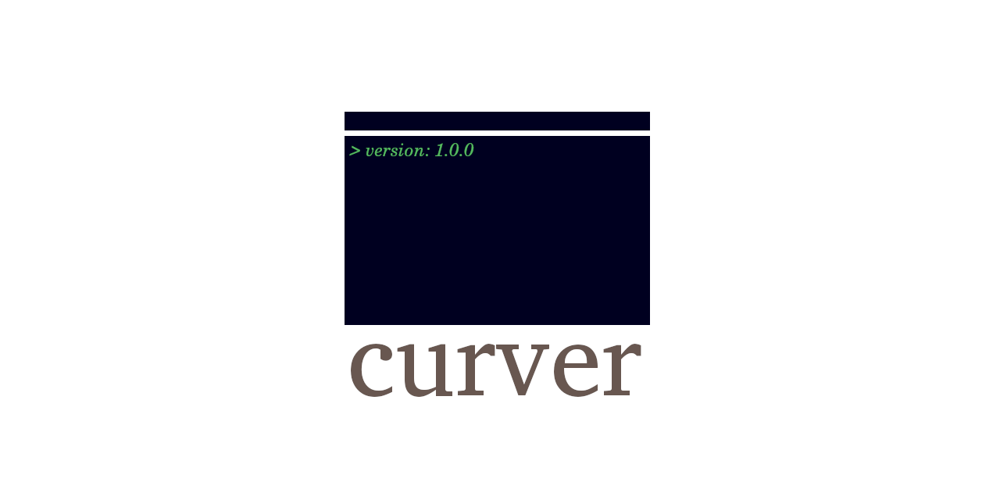

  

`curver` is a simple way to display the version of a command made in go.
`curver` was named as an abbreviation for `current version`.

# Table of Contents
- [Table of Contents](#table-of-contents)
- [usage](#usage)
- [License](#license)

# usage

# License
[MIT](LICENSE)
